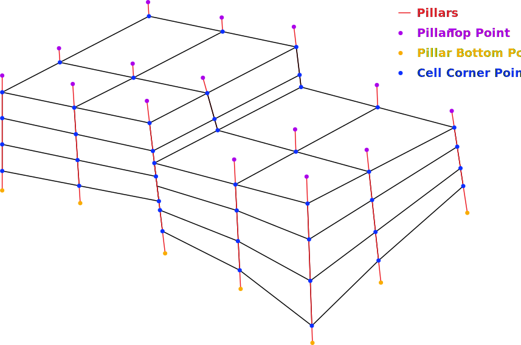
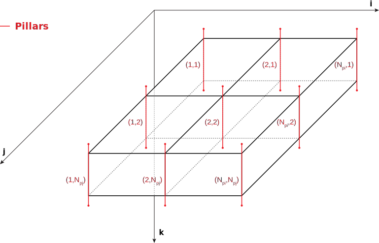
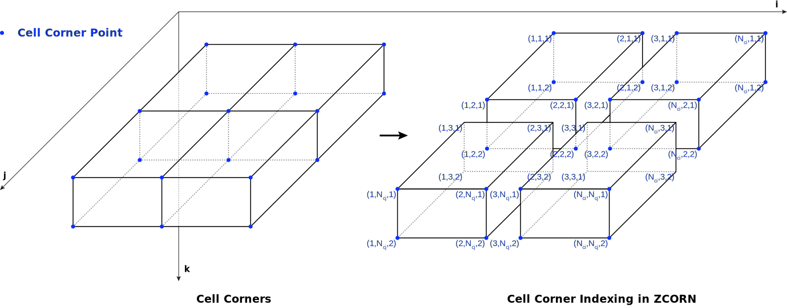

.. _corner-point-grids:
Corner-Point Grid
=================

Overview
--------

A **Corner-Point grid (CPG)** is a three-dimensional structured grid
widely used in reservoir simulation to represent complex geological
structures. The grid is defined on a logical indexing system
:math:`(i, j, k)`, which determines cell connectivity independently of
geometric shape. This separation of topology and geometry allows the grid
to retain a structured layout while accommodating highly irregular,
non-orthogonal, and :ref:`non-conforming grids <conforming-vs-nonconforming-grids>`
geometries, such as faults and stratigraphic discontinuities.

.. _fig-corner-point-grid-example:

   Example of a non-conforming Corner-Point grid with dimensions :math:`4 \times 2 \times 3`, corresponding to :math:`(i, j, k)`.

In a Corner-Point grid, each cell is defined by eight corner points forming
a general hexahedron. The geometry of each cell is described by the Cartesian
coordinates of these corners, allowing cells to be non-orthogonal, skewed,
inclined, and spatially variable in size and shape while remaining structured
in logical space. Compared with :ref:`Rectilinear grids <rectilinear-grids>`, this representation requires
additional geometric information.

Although each cell is conceptually defined by eight corner points, these
coordinates are not stored independently. Since adjacent cells share common
corners, explicitly storing full :math:`(x, y, z)` coordinates for every corner
would introduce redundancy and may lead to inconsistencies due to numerical
precision. Instead, the geometry is defined implicitly and reconstructed from
pillar geometry and corner depth values.

Pillar Geometry
---------------

The grid is supported by a set of vertical or inclined **pillars** arranged
on an :math:`(i, j)` lattice. Each pillar is defined by two endpoints in
three-dimensional space: a top point
:math:`(x_{\mathrm{top}}, y_{\mathrm{top}}, z_{\mathrm{top}})` and a bottom point
:math:`(x_{\mathrm{bot}}, y_{\mathrm{bot}}, z_{\mathrm{bot}})`. Pillars define
the lateral structure of the grid and act as reference lines for locating
corner points, but they are not sufficient on their own to fully define
cell geometry.

.. _fig-pillar-indexing:

   Pillar arrangement and indexing on the :math:`(i, j)` lattice; :math:`P_i` and :math:`P_j` denote the number of pillars in the :math:`i` and :math:`j` directions.

Corner-Point Interpolation
--------------------------

Corner coordinates are obtained by interpolating along pillars using
corner depths provided in the grid definition. For a corner located at
depth :math:`z_c`, its relative position along the pillar is defined as:

.. math::

   t = \frac{z_c - z_{\mathrm{top}}}{z_{\mathrm{bot}} - z_{\mathrm{top}}}

where pillar endpoints are defined as :math:`(x_{\mathrm{top}}, y_{\mathrm{top}}, z_{\mathrm{top}})` and :math:`(x_{\mathrm{bot}}, y_{\mathrm{bot}}, z_{\mathrm{bot}})`. 
The parameter :math:`t` represents the fractional distance along the pillar, where :math:`t = 0` corresponds
to the top and :math:`t = 1` corresponds to the bottom. The full three-dimensional coordinates of the corner are obtained by
linear interpolation:

.. math::

   x_c = x_{\mathrm{top}} + t \left(x_{\mathrm{bot}} - x_{\mathrm{top}}\right)

.. math::

   y_c = y_{\mathrm{top}} + t \left(y_{\mathrm{bot}} - y_{\mathrm{top}}\right)

.. math::

   z_c = z_{\mathrm{top}} + t \left(z_{\mathrm{bot}} - z_{\mathrm{top}}\right)

This formulation ensures that each corner lies exactly on its associated
pillar and that neighboring cells sharing a pillar produce identical
corner coordinates. A complete grid cell is constructed by applying this
interpolation to all eight corners using the appropriate pillar and
corner depth values.

Representation in Eclipse
-------------------------

In Hopsin  simulator, Corner-Point grids are defined using ``DIMENS``, ``COORD``, ``ZCORN`` keywords, and optionally ``ACTNUM`` keyword.
This set of keywords that separately describe topology, geometry, and cell activity.

.. list-table:: Description of Eclipse Corner-Point grid keywords.
   :header-rows: 1
   :widths: 10 30 30 30
   :class: eclipse-keyword-table
    
   * - Keyword
     - Definition
     - Size
     - Logical Shape
   * - COORD
     - Pillar endpoint coordinates (top and bottom)
     - :math:`6 (N_i + 1)(N_j + 1)`
     - :math:`(N_j + 1, N_i + 1, 6)`
   * - ZCORN
     - Corner depth values for all cells
     - :math:`8 N_i N_j N_k`
     - :math:`(2N_k, 2N_j, 2N_i)`
   * - ACTNUM
     - Cell activity mask (active/inactive)
     - :math:`N_i N_j N_k`
     - :math:`(N_k, N_j, N_i)`

.. _eclipse-dimens:

DIMENS
~~~~~~

The ``DIMENS`` keyword specifies the grid dimensions
and defined in ``RUNSPEC`` section of the Eclipse input file.
It defines the number of grid cells in each coordinate direction
required to correctly reconstruct the grid topology.

- :math:`N_i` — number of cells in the :math:`i` (x) direction  
- :math:`N_j` — number of cells in the :math:`j` (y) direction  
- :math:`N_k` — number of layers in the :math:`k` (z) direction

In the Eclipse input file, the dimensions are defined in the order :math:`(N_i, N_j, N_k)`:

.. code-block:: text

   RUNSPEC
   
   DIMENS
    4 2 3
   /

.. _eclipse-coord:
COORD
~~~~~

The ``COORD`` keyword defines the geometry of grid pillars by specifying
the top and bottom endpoints of each pillar. 
The number of pillars is determined from grid dimensions as:

.. math::

   N_{pi} = N_i + 1, \quad N_{pj} = N_j + 1

Thus, the total number of pillars is :math:`(N_i + 1)(N_j + 1)`.
Each pillar is represented by six values:

.. math::

   (x_{top},\; y_{top},\; z_{top},\; x_{bot},\; y_{bot},\; z_{bot})

Accordingly, the logical shape of the ``COORD`` array is :math:`(N_j + 1,\; N_i + 1,\; 6)` 
and the total number of stored values is :math:`6 (N_i + 1)(N_j + 1)`.

.. _eclipse-zcorn:
ZCORN
~~~~~

The ``ZCORN`` keyword stores the corner depth values for all grid cells.
For a grid of size :math:`(N_i, N_j, N_k)`, the total number of entries is :math:`8 N_i N_j N_k`.
This corresponds to the number of corner points along each axis:

.. math::

    N_{ci} = 2N_i, \quad N_{cj} = 2N_j, \quad N_{ck} = 2N_k

The factor of 2 arises because each cell contributes two corner positions
along each axis (e.g., left/right, front/back, top/bottom). Thus, the logical array shape is :math:`(2N_k,\; 2N_j,\; 2N_i)`.

Although neighboring cells share physical corner points, ``ZCORN`` stores
corner depths per cell (:numref:`fig-eclipse-zcorn-indexing`). This allows representation of non-conforming
geometries such as faults and pinch-outs.

.. _fig-eclipse-zcorn-indexing:

   Example of :math:`(i, j, k)` cell corner indexing in ``ZCORN`` (here :math:`N_j = 1`).

ACTNUM
~~~~~~

The ``ACTNUM`` keyword defines the activity status of each grid cell.

- ``1`` → active (included in simulation)  
- ``0`` → inactive (excluded from simulation)  

It does not modify the geometry defined by :ref:`COORD <eclipse-coord>` and :ref:`ZCORN <eclipse-zcorn>`. Instead, it acts as a mask over the defined cells,
determining which cells participate in the simulation. 

.. note::
    
    This keyword is optional; if omitted, all cells are assumed active.