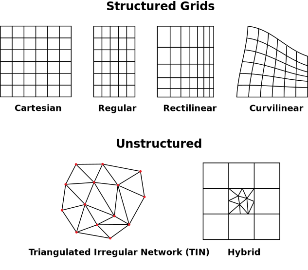
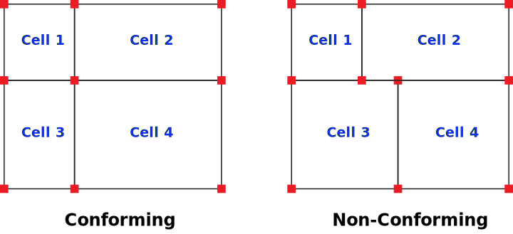

Grid Classification
===================

Reservoir simulation grids can be classified based on how cells are
organized, connected, and discretized in space. These classifications
govern both the numerical behavior of the model and its ability to
represent geological complexity.

Understanding these distinctions is essential when selecting an
appropriate grid for a given reservoir simulation problem.

Structured vs Unstructured Grids
--------------------------------

The most fundamental classification is based on grid connectivity—how
cells are indexed and how neighbor relationships are defined.

.. _fig-structured-vs-unstructured:

   Structured vs unstructured grid comparison.

In a **structured grid**, cells are arranged in a regular
three-dimensional layout. Each cell is uniquely identified by a triplet
of indices ``(i, j, k)``, which directly encode its spatial position.
Neighboring cells are implicitly defined through index adjacency
(e.g., ``i±1``, ``j±1``, ``k±1``), meaning connectivity does not need to
be stored explicitly.

This regular topology enables efficient memory usage and fast traversal
of grid cells, making structured grids particularly well suited for
finite-difference formulations commonly used in reservoir simulation.

As shown in :numref:`fig-structured-vs-unstructured`, structured grids
rely on index-based neighborhood relationships, while unstructured grids
store connectivity explicitly.

In contrast, an **unstructured grid** does not follow a regular indexing
scheme. Cells are identified by unique IDs, and connectivity must be
stored explicitly using data structures such as adjacency lists.

This flexibility allows unstructured grids to represent complex
geometries more accurately, including faults, irregular boundaries,
and localized refinements. However, this comes at the cost of increased
memory usage and computational complexity.

Uniform vs Non-Uniform Grids
----------------------------

Another important distinction relates to grid spacing, which determines
how cell dimensions vary across the domain.

In a **uniform grid**, spacing remains constant along each axis. The
distances ``Δx``, ``Δy``, and ``Δz`` are fixed, resulting in cells of
identical size throughout the model. This simplicity leads to predictable
numerical behavior and straightforward implementation.

In a **non-uniform grid**, spacing varies spatially, allowing cell sizes
to change along one or more directions. This enables local refinement in
regions of interest, such as near wells, faults, or boundaries, where
higher resolution is required to capture critical flow behavior.

Non-uniform grids therefore provide greater modeling flexibility while
maintaining compatibility with structured grid frameworks.

.. _fig-uniform-vs-nonuniform:

   Uniform vs non-uniform grid spacing comparison.

As illustrated in :numref:`fig-uniform-vs-nonuniform`, non-uniform
spacing concentrates resolution where physics or geometry require it.

Conforming vs Non-Conforming Grids
----------------------------------

Grid conformity describes how cell faces align between neighboring cells
and plays an important role in numerical consistency.

.. _fig-conforming-vs-nonconforming:

   Conforming vs non-conforming grid comparison showing mismatched face connectivity between adjacent cells.

See :numref:`fig-conforming-vs-nonconforming` for a visual comparison of
aligned versus mismatched face connectivity across neighboring cells.

In a **conforming grid**, each cell face matches exactly one neighboring
face. The geometric alignment between cells is consistent across the
grid, which simplifies flux calculations and supports efficient numerical
schemes. Typical examples include: **cartesian**, **rectilinear**, and **corner-point** grids.

In a **non-conforming grid**, a single cell face may connect to multiple
neighboring faces, resulting in partial or mismatched alignment. This
situation commonly arises in locally refined grids or adaptive mesh
refinement (AMR) workflows.

While non-conforming grids allow for increased flexibility and targeted
resolution, they require more advanced numerical treatment to ensure
flux consistency and conservation across interfaces.
